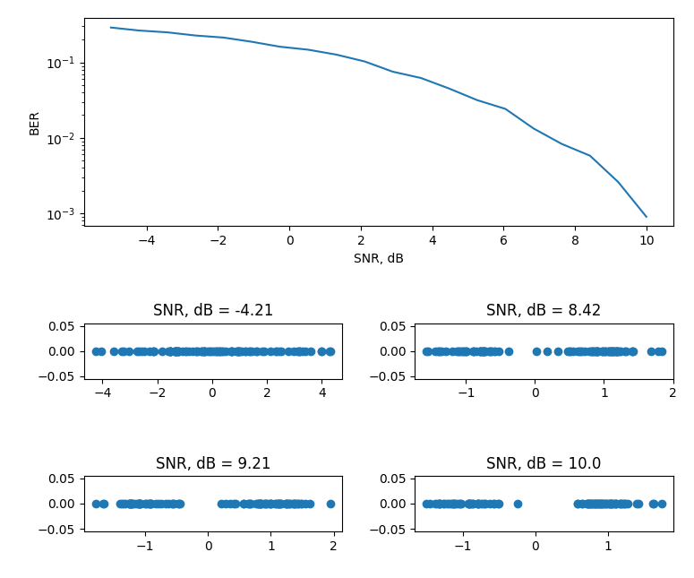
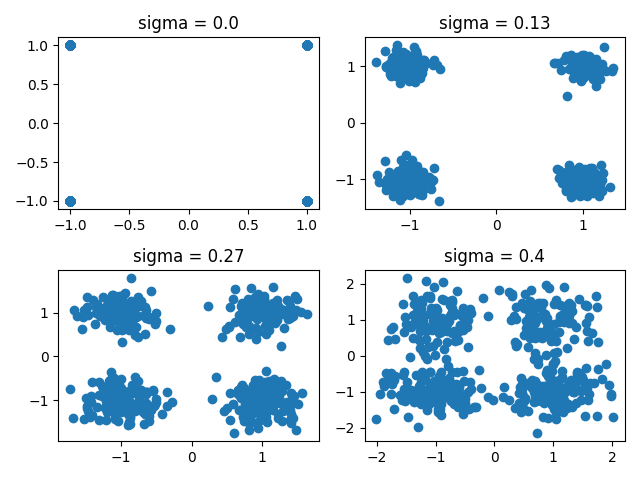

# Моделирование цифровых видов модуляции в Python

Учебный проект по моделированию цифровой передачи сигналов в канале с шумом.  
В проекте реализованы примеры для **BPSK**, **QPSK**, **16-QAM**, а также визуализация **аналогового сигнала для 16-QAM**. Код строит графики созвездий, зависимости BER от SNR и временные/спектральные представления сигналов.

## Что реализовано

### 1. BPSK в канале AWGN
Скрипт `BPSK_AWGN.py` моделирует передачу бинарного сигнала через канал с аддитивным белым гауссовским шумом.  
Для разных значений SNR вычисляется **BER (Bit Error Rate)** и строится график зависимости BER от SNR в логарифмическом масштабе. Также отображаются примеры распределения зашумлённых символов при нескольких уровнях SNR.



### 2. QPSK
Скрипт `QPSK.py` генерирует случайную битовую последовательность, преобразует её в символы QPSK и отображает **созвездие сигнала** при разных значениях шума `sigma`. Это позволяет увидеть, как шум влияет на расположение точек в комплексной плоскости.



### 3. 16-QAM
Скрипт `QAM16.py` реализует отображение бит в символы 16-QAM через уровни амплитуды по осям **I** и **Q**. После добавления комплексного шума строится **диаграмма созвездия**. В коде используется 4-битное представление одного символа: 2 бита на I и 2 бита на Q.


### 4. Аналоговое представление 16-QAM
Скрипт `QAM16_Analog.py` расширяет модель 16-QAM и показывает:
- диаграмму созвездия;
- аналоговый модулированный сигнал;
- временные реализации компонент **I** и **Q**;
- спектр сигнала через БПФ.


## Структура проекта

```text
.
├── Images/
│   ├── BPSK.png
│   ├── QAM 16 Analog.png
│   ├── QAM 16.png
│   └── QPSK.png
├── BPSK_AWGN.py
├── QPSK.py
├── QAM16.py
└── QAM16_Analog.py
```

## Как запускать

Каждый файл запускается отдельно:

```bash
python BPSK_AWGN.py
python QPSK.py
python QAM16.py
python QAM16_Analog.py
```

После запуска откроются окна с графиками.
